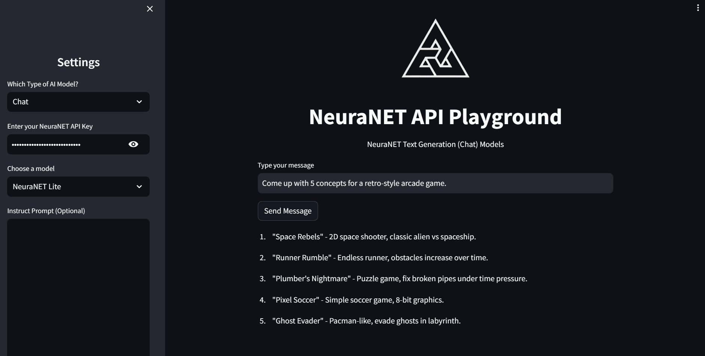

# NeuraNET API Playground

## Overview

This Streamlit application is the official [NeuraNET API Playground](https://playground.neuranet-ai.com) and provides an interactive interface to the NeuraNET API, allowing users to access and utilize AI models for chat, image generation, and chat with vision capabilities.

### Features
- **API Authentication**: Secure API key input for accessing NeuraNET services.
- **Model Selection**: Users can choose between chat, chat with vision, image generation, text to speech and moderation models.
- **Dynamic Inputs**: Input fields adapt based on the model selected.
- **Error Handling**: The app includes checks for missing API keys and empty inputs, along with error messages for user guidance.

## Installation

1. Install requirements with `pip install -r requirements.txt`

## Usage

Run the app with the command: `streamlit run main.py`

### Supported Models
#### Chat Models
- **NeuraNET Lite**: A free version of the NeuraNET chat AI, perfect for basic queries and conversations.
- **NeuraNET Pro**: A premium chat model offering advanced understanding and more detailed responses.
- **NeuraNET Pro Vision**: Only accessible to paying beta testers, this model combines the capabilities of advanced chat functionalities with vision to interpret and discuss images.

#### Image Models
- **Vinci Mini**: A free and fast version for basic image generation tasks.
- **Vinci Max**: A premium image generation model delivering high-quality visual content.

### Image Generation Models
- **Model Choice**: Select between 'Vinci Mini' and 'Vinci Max'.
- **Prompt Input**: Enter a prompt for image generation.
- **Generate Image**: Click to generate images based on the provided prompt.

### Chat Models
- **Model Choice**: Select between 'NeuraNET Lite' and 'NeuraNET Pro'.
- **Instruct Prompt**: Optional field for additional instructions.
- **User Input**: Type your message for the chat model.
- **Send Message**: Click to interact with the chat model.

### TTS Model
The NeuraNET Text-to-Speech AI Model, referred to as NeuraNET Mint, has an array of 300 distinct voice options. This model and API can be used for completely free of charge.

### Moderation Model
The NeuraNET Text Moderation AI Model, referred to as NeuraNET Sentinel, is a large moderation model for moderating text. The moderation model has 2 variations: Default and Unbiased. This model and API can be used for completely free of charge.

## API Endpoints
- Image Generation: `POST https://neuranet-ai.com/api/v1/image`
- Chat: `POST https://neuranet-ai.com/api/v1/chat`
- TTS: `POST https://neuranet-ai.com/api/v1/tts`
- Moderation: `POST https://neuranet-ai.com/api/v1/moderation`

## License

The NeuraNET API Playground is open-source and is under the MIT License. See the [LICENSE](LICENSE) for more information.

Developed by the NeuraNET Team
